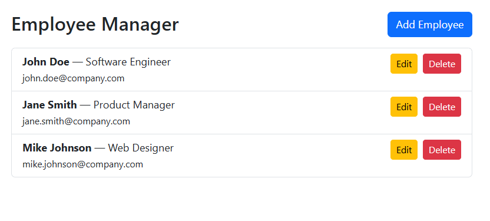
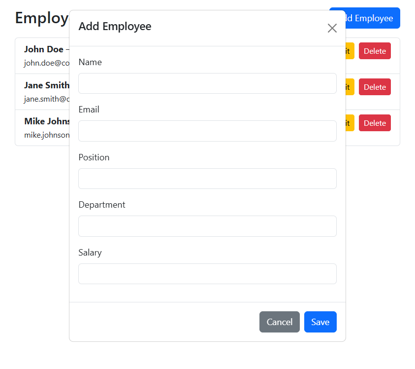

# Homework: Create simple web application to manage employee using React

1. Create a sample API using json-server for managing employee data, enabling CRUD operations.
2. In React, fetch the data to display it, and implement functionality for inserting, deleting, and updating employee records.
   
#### Created by Nou Sophavattey

- Project code: https://github.com/sophavattey/module2-react-employee-dbjson-hm.git
- Project demo: https://sophavattey.github.io/module2-react-employee-dbjson-hm/

## Screenshots

## How to run locally
1. git clone: https://github.com/sophavattey/module2-react-employee-dbjson-hm.git
2. install: ``npm install -g json-server``
3. start sever on port 3001: ``json-server --watch db.json --port 3001``
4. then ``npm start``

